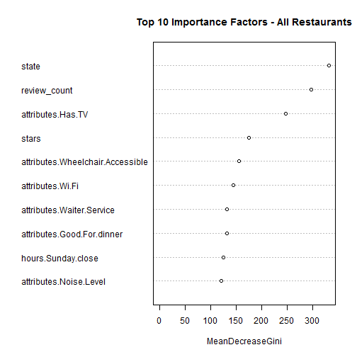
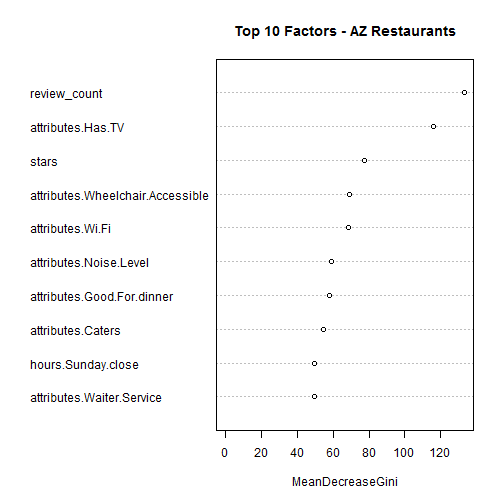
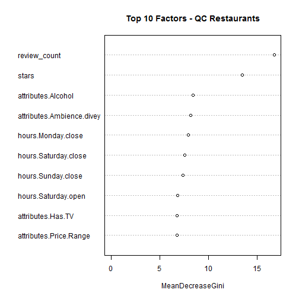

Predicting Open Restaurants from Yelp Attributes
========================================================
author: Zeydy Ortiz, Ph. D.

)


Introduction
========================================================

What are the factors that indicate a restaurant is in operation (open)?

This project demonstrates the use of a predictive model to uncover
insights on the important factors influencing the model.
In this case I used the business attributes for restaurants to predict
whether they are in operation (open).  

However, the most interesting part was understanding
the importance factors for the model and building separate models for
restaurants in different geographical areas.
Restaurant owners could use the insights to make sure they have the
attributes that are desirable for their clientele.

Methods and Data
========================================================

The data used in this report is part of the Round 6 Yelp Dataset Challenge
provided for the Data Science Capstone project.  The business 
information is from the `yelp_academic_dataset_business.json` file.

To predict `open`, I used the `Attributes` in the business file including
some information on the location (`state`), hours of operation, and even the average star rating from Yelp.

I also built separate models for `state == AZ` and `state == QC` and looked at the importance factors (by mean decrease Gini).

Model
========================================================
The general random forest model was created with this code:

```
# Split data set
set.seed(123)

split <- sample.split(rest_df$open, SplitRatio = 0.7)
train <- subset(rest_df, split==TRUE)
test <- subset(rest_df, split==FALSE)

# Build random forest
set.seed(456)
restRF <- randomForest(open~., data=train)
predRF <- predict(restRF, newdata=test)
table(predRF, test$open)
```

Results and Discussion
========================================================

The accuracy of the baseline model (all restaurants classified as
open==TRUE) is 80%.  The general random forest model created increased
the accuracy to 85%.  

The top 10 importance factors for the model
provide insights on the attributes that help predict open restaurants.
See next page for importance factors for different geographical areas. 

* * *

 

Comparison
========================================================
`state == AZ`
 

* * *
`state == QC`
 
